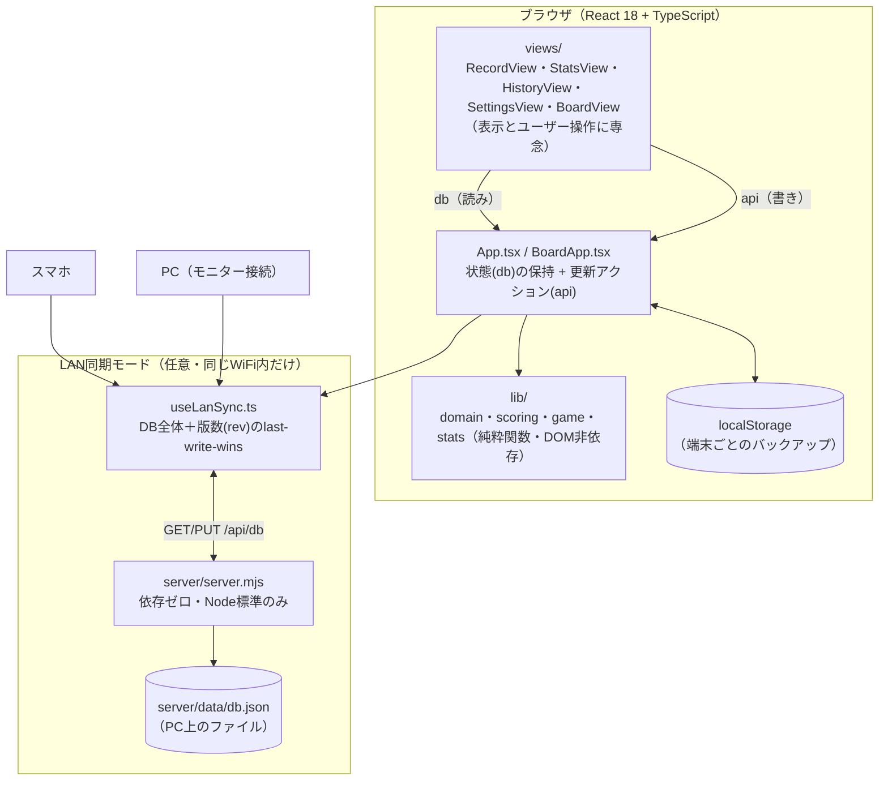

# 麻雀トラッカー（MaaNanoJa）

月イチの家麻雀（4人打ち）のスコアと、放銃・和了・立直などの局データまで記録して分析する、**バックエンド不要・ブラウザ完結**のWebアプリ。

いつも使っている [namimori 氏の麻雀集計スプレッドシート](https://hirokuasaku-live.blogspot.com/2022/08/mahjong-spreadsheet-new.html) のスコア計算をそのまま再現したうえで、**局ごとの記録**を足して統計を出せるようにした。データはブラウザの localStorage に保存され、外部サーバーには一切送信しない。

当日は任意で「PCモニターに全員ぶんを映しつつ、入力はスマホ・PCどちらからでも」というLAN内完結の同期モードも使える。

## デモ画面

**局ログ入力** — 和了（ロン/ツモ）・流局を1局ずつ記録。翻符を選ぶだけで点数移動・積み棒・供託リーチ棒まで自動計算され、右側に局ログがリアルタイムで積み上がる。


**成績タブ** — 合計スコア・着順分布・和了率/放銃率/立直率などをPC幅では一画面で見渡せる2カラムに、着順は色覚多様性に配慮した順序色＋数値ラベルの併記で表示。


**モニター表示（`?board=1`）** — 卓を囲む全員から見える大画面用の全画面スコアボード。誰かの端末をテレビ/モニターに繋いで開く。


## できること

- **記録**
  - 「局ログで記録」… 和了（ロン / ツモ）・流局・途中流局を1局ずつ記録。翻符を入れると点数移動・本場・供託リーチ棒・親の連荘/流れまで**自動計算**され、持ち点がリアルタイムに動く。ダブロンにも対応し、点数の自動計算がずれた場合は手動で補正できる。
  - 「最終点だけ入力」… 従来どおり終局の持ち点だけ入力するシンプルなモード。
  - 終局で順位 → ウマ・オカ込みのスコアを自動算出。
- **成績**
  - 合計スコア / 平均スコア / 平均順位 / 着順分布 / トップ率 / 連対率 / ラス率 / トビ率 / 平均素点
  - 局ログがあれば：**和了率 / 放銃率 / 立直率 / ツモ率 / 平均和了点 / 平均放銃点 / テンパイ率**
- **履歴**：半荘ごとの結果と局ログを閲覧・削除。
- **設定**：メンバー・ルール（持ち点 / 返し点 / ウマ）の変更、JSONでの書き出し／読み込み。
- **LAN同期（任意）**：同じWiFi内のPC・スマホから同じデータを見て・入力できる。詳しくは [SETUP.md](./SETUP.md) を参照。

## アーキテクチャ

ロジック（`lib/`）と画面（`views/`）を分離し、状態は `App.tsx` の単一 `db` に集約する構成。LAN同期は既存の構造に対して「同じ `db` をサーバ経由でも共有する」という薄い後付けレイヤーになっている。



- **`lib/`** が仕様の中心。副作用なし・ブラウザ非依存の純粋関数で、テスト（`*.test.ts`）が「実行できる仕様」として振る舞いを固定する。
- **`views/`** は計算ロジックを持たず、`db`（読み）と `api`（書き）だけを受け取る。
- LAN同期は **DB全体＋版数の last-write-wins**。サーバが居なければ従来どおり localStorage だけで動き、`npm run dev` の挙動は変わらない。設計の割り切りは [CLAUDE.md](./CLAUDE.md) を参照。

## 技術スタック

- React 18 + Vite + **TypeScript（strict）**
- テスト: Vitest / Lint: ESLint(flat) / 整形: Prettier（CIでゲート化）
- 依存は最小限。UIライブラリ・状態管理ライブラリ・CSSフレームワークは使わない。LAN同期サーバも依存ゼロ（Node標準のみ）。
- 外部サービス・クラウドなし。データは常にブラウザ内 or 同じWiFi内で完結する。

## はじめる

```bash
npm install
npm run dev
```

セットアップの詳細・使い方・LAN同期モードの手順は **[SETUP.md](./SETUP.md)** にまとめてある。

## ドキュメント

- **[SETUP.md](./SETUP.md)** — セットアップ・使い方・LAN同期モードの手順。
- **[CLAUDE.md](./CLAUDE.md)** — 開発ガイド（どこに・何を・どう書くか、設計ルール）。
- **[SPEC.md](./SPEC.md)** — 振る舞いの仕様（スコア計算・データモデル・不変条件）。
