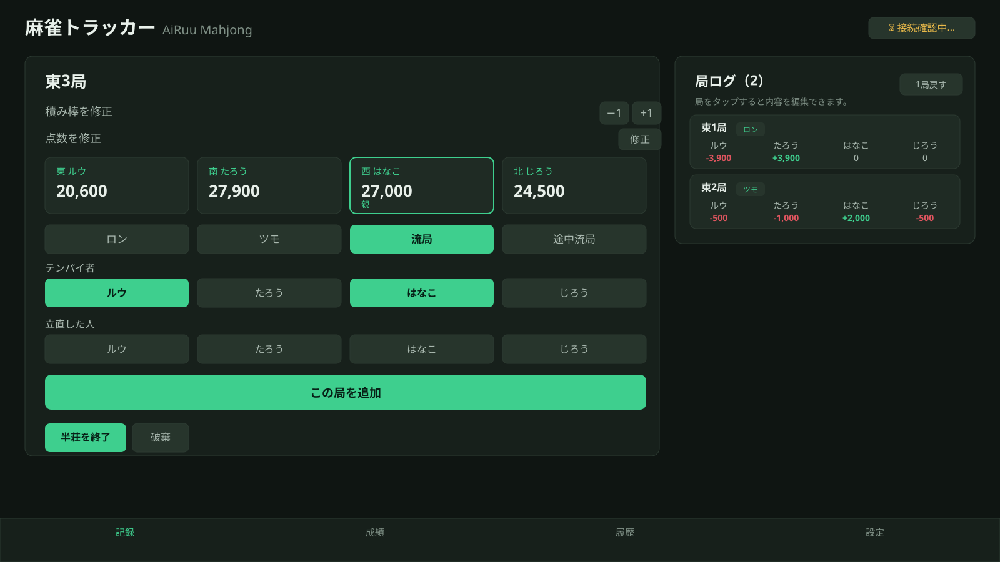
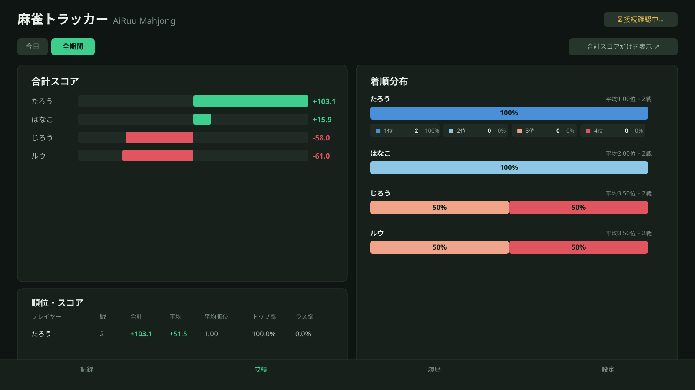
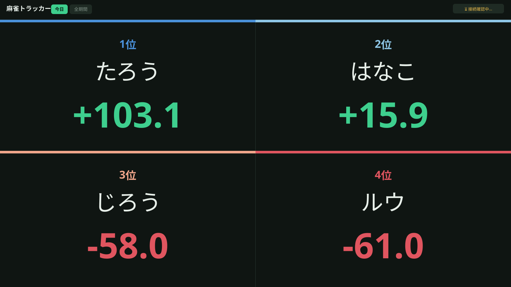
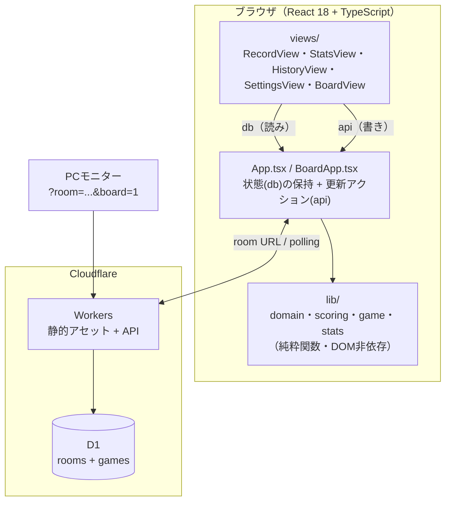

# 麻雀トラッカー（MaaNanoJa）

4人打ち麻雀のスコアと、放銃・和了・立直などの局データを記録して分析するWebアプリです。Cloudflare Workers + D1を本体とし、ルームURLを開いたPC・スマホで同じ対局を共有します。

いつも使っている [namimori 氏の麻雀集計スプレッドシート](https://hirokuasaku-live.blogspot.com/2022/08/mahjong-spreadsheet-new.html) のスコア計算を再現したうえで、**局ごとの記録**を足して統計を出せるようにしています。通常のデータはブラウザや家庭内サーバーには保存せず、Cloudflare D1へルーム単位で保存します。

## デモ画面

**局ログ入力** — 和了（ロン/ツモ）・流局を1局ずつ記録。翻符を選ぶだけで点数移動・積み棒・供託リーチ棒まで自動計算され、右側に局ログがリアルタイムで積み上がります。



**成績タブ** — 合計スコア・着順分布・和了率/放銃率/立直率などをPC幅では一画面で見渡せる2カラムに、着順は色覚多様性に配慮した順序色＋数値ラベルの併記で表示します。



**モニター表示（`?room=...&board=1`）** — 卓を囲む全員から見える大画面用の全画面スコアボードです。誰かの端末をテレビ/モニターに繋いで開きます。



## できること

- **記録**
  - 「局ログで記録」… 和了（ロン / ツモ）・流局・途中流局を1局ずつ記録。翻符を入れると点数移動・本場・供託リーチ棒・親の連荘/流れまで**自動計算**します。
  - 「最終点だけ入力」… 従来どおり終局の持ち点だけを入力するシンプルなモードです。
  - 終局で順位 → ウマ・オカ込みのスコアを自動算出します。
- **成績**：合計スコア、平均順位、着順分布、トップ率、連対率、ラス率、和了率、放銃率、立直率など。
- **履歴**：半荘ごとの結果と局ログを閲覧・削除します。
- **設定**：メンバー・ルール（持ち点 / 返し点 / ウマ）の変更、JSONバックアップの書き出し。
- **ルーム共有**：新しいルームを作成するか、共有されたルームURLへ参加します。旧localStorage履歴がある端末だけ、明示的に新規ルームへ移行できます。
- **Googleログイン**：Google OAuthを有効にすると、初回ログイン時にアカウントが自動作成され、作成したルームが「自分のルーム」に残ります。

## アーキテクチャ

ロジック（`lib/`）と画面（`views/`）を分離し、状態は `App.tsx` の単一 `db` に集約します。通常の読み書きはCloudflare Worker APIを通り、D1が正式な保存先です。



- `lib/` が仕様の中心です。副作用なし・ブラウザ非依存の純粋関数で、テストが振る舞いを固定します。
- `views/` は計算ロジックを持たず、`db`（読み）と `api`（書き）だけを受け取ります。
- Cloudflare接続に失敗しても、ローカル保存へサイレントにフォールバックしません。再接続またはルームURLの確認を行います。
- 旧localStorageの読み取りは移行期間だけの境界で、通常のデータ保存には使いません。
- Google OAuthのClient SecretとセッションハッシュはWorker Secret/D1で安全に管理し、ブラウザにはHttpOnly Cookieだけを渡します。

## 技術スタック

- React 18 + Vite + **TypeScript（strict）**
- Cloudflare Workers + D1
- テスト: Vitest / Lint: ESLint / 整形: Prettier
- 依存は最小限。UIライブラリ・状態管理ライブラリ・CSSフレームワークは使いません。

## はじめる

```bash
npm install
npm run dev       # Cloudflare Worker + D1のローカル開発環境
```

セットアップの詳細・使い方・公開手順は **[SETUP.md](./SETUP.md)** にまとめています。

## Cloudflareで公開する

Cloudflare Workers + D1の構成と公開手順は [SETUP.md](./SETUP.md) と [docs/cloudflare-first-spec.md](./docs/cloudflare-first-spec.md) を参照してください。

```bash
npm run cf:db:local  # ローカルD1を初期化
npm run cf:dev       # Worker + D1をローカル起動
npm run cf:deploy    # workers.devへ公開
```

公開後はアプリで「新しいルームを作る」を押し、表示されたURLまたはコードを参加者へ共有します。

## ドキュメント

- **[SETUP.md](./SETUP.md)** — セットアップ・使い方・Cloudflare公開手順。
- **[CLAUDE.md](./CLAUDE.md)** — 開発ガイド（どこに・何を・どう書くか、設計ルール）。
- **[SPEC.md](./SPEC.md)** — 振る舞いの仕様（スコア計算・データモデル・不変条件）。
- **[docs/cloudflare-first-spec.md](./docs/cloudflare-first-spec.md)** — Cloudflare-first化の正式仕様。
